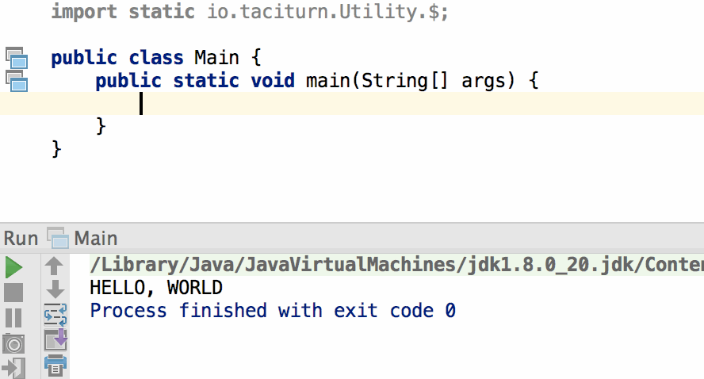

# Taciturn

A contextual Java utility library intended to augment built-in objects, such as `Integer`, `Short`, `Long`,
`Float`, `Double`, `HashSet`, `ArrayList`, Arrays, and many others.

## Introduction

This library is targeted to Java 8 users who want to add some extra functionality to their favorite objects. You
will likely notice some similarities to notable Javascript libraries jQuery and Underscore. The goal of Taciturn
is to only add what is missing. You won't find many passthrough methods to the wrapped objects.

It should be noted that Taciturn is very immature at this time. Keep in mind that the method signatures may
change over the coming weeks. Hopefully it will settle into a grove in the near future. Once we hit the `1.0.0`
version, I will be sure to deprecate anything that will disappear in an upcoming release. Until then, I hope
that you will be willing to put up with a small amount of chaos.

## Hello World

Once you have added the dependency, getting started with Taciturn is pretty straightforward. The only include
required is `import static io.taciturn.Utility.$;`. The snippet below shows the creation of a list of strings
from a raw array, which are then printed out to the console.

## Working With `Comparable` Objects

I'll create a better gif later that uses the less-than and greater-than methods, but I think that you will
get the gist from below.

## Working With `Array` Objects

You can create either create an array beforehand and pass it into Taciturn, or you can create it on the
fly as shown below.

## More to Come

...
